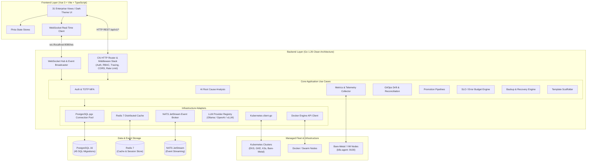

# K8sControl — Self-Hosted Infrastructure Control Plane

[](https://go.dev/)
[](https://vuejs.org/)
[](https://vitejs.dev/)
[](https://www.postgresql.org/)
[](https://www.docker.com/)
[](https://opensource.org/licenses/MIT)

---

## Overview

**K8sControl** is an enterprise-grade, self-hosted infrastructure control plane engineered for unified management of Kubernetes clusters, Docker Swarm fleets, and bare-metal compute hosts. Built with a clean architecture Go backend and a responsive Vue 3 TypeScript frontend, it delivers complete visibility, operational automation, and resilience across multi-cloud and on-premise environments.

The platform provides end-to-end operational capabilities including real-time container log streaming, Service Level Objective (SLO) error budget burn-rate tracking, GitOps configuration drift detection, and automated deployment promotion pipelines. An integrated AI multi-agent orchestration engine connects to local (Ollama, vLLM) and cloud (OpenAI, Gemini) language models to execute automated root-cause analysis (RCA) on infrastructure incidents with confidence scoring.

K8sControl incorporates security and governance from the ground up: AES-256-GCM encryption for stored cluster and cloud provider credentials, fine-grained multi-tenant Role-Based Access Control (RBAC), Time-based One-Time Password (TOTP) two-factor authentication, an internal Service Catalog with template scaffolding, and 31 dedicated enterprise screens.

---

## Key Features

### 🖥️ Infrastructure & Compute Management
- **Multi-Cluster Orchestration**: Unified control plane for Kubernetes clusters (via kubeconfig or Bearer tokens) and Docker Swarm / standalone Docker daemons.
- **Dynamic Resource Explorer**: Real-time inspection and YAML editing of Kubernetes Pods, Deployments, StatefulSets, DaemonSets, Services, ConfigMaps, and CRDs.
- **Compute Host Agent (`k8s-agent`)**: Lightweight Go daemon providing host-level CPU, memory, disk, network, and systemd service telemetry over HTTP port `9100`.
- **Docker Engine Integration**: Native Docker API socket/TCP integration for container lifecycle management, image management, and container log streaming.

### 🛡️ Security & Governance
- **Zero-Exposure Credential Encryption**: AES-256-GCM encryption for all stored credentials, cluster tokens, cloud accounts, and SSH private keys.
- **Multi-Tenant RBAC**: Strict role-based isolation supporting `platform_admin`, `tenant_admin`, `operator`, and `viewer` roles with tenant data segmentation.
- **Two-Factor Authentication (2FA)**: RFC 6238 TOTP two-factor authentication with QR code setup and cryptographically hashed recovery codes.
- **Comprehensive Audit Trail**: Tamper-evident logging of all state mutations, authentication events, and API executions with IP tracking.

### 📊 Observability & Reliability Engineering
- **SLO / SLI Tracking**: Service Level Objective monitoring with error budget burn-rate calculations, uptime metrics, and alerting triggers.
- **Real-Time Live Logs**: In-browser real-time log aggregator streaming stdout/stderr across Docker containers and Kubernetes pods via WebSockets.
- **Prometheus & OpenTelemetry**: Native `/metrics` endpoint with optional Bearer token protection and OpenTelemetry gRPC distributed tracing.
- **Fleet-Wide Health Center**: Aggregated health scoring, cluster status, and latency monitoring updated via high-frequency background workers.

### 🚀 Developer Portal & Catalog
- **Service Catalog**: Centralized catalog of organizational microservices, metadata, documentation links, lifecycle statuses, and tier classifications.
- **Scaffolder Engine**: Parameterized project scaffolding with templates for Go, Node.js, Python, and Docker services with instant ZIP bundle download.
- **Ecosystem & Plugin Hub**: Extensible integrations for CI/CD runners (GitHub Actions, GitLab CI, ArgoCD), artifact registries, and webhooks.

### ⚙️ Operations & GitOps
- **GitOps Drift Detection**: Automated comparison of live cluster states against Git repository baselines with visual diff inspectors.
- **Environment Promotion**: Automated multi-stage deployment promotion pipelines (Development → Staging → Production) with manual approval gates.
- **Executable Runbooks**: Interactive operational runbooks with executable shell/API steps and execution audit histories.
- **Enterprise Backup & Restore**: Snapshot scheduling, multi-driver backup engines (Local, S3), and point-in-time restoration.

### 🤖 AI-Powered Incident RCA
- **Multi-Agent Orchestrator**: Multi-agent delegation for triage, log analysis, architectural validation, and remediation proposals.
- **Automated Root Cause Analysis (RCA)**: Automated event correlation and log analysis powered by local LLMs (Ollama, vLLM) or OpenAI.
- **Circuit Breaker Protection**: Provider health polling with automatic circuit breaking and fallback between configured AI endpoints.

---

## Architecture



---

## Two Deployment Modes

K8sControl is designed to run in two distinct modes depending on your infrastructure requirements:

| Capability | Standalone Mode (`cmd/standalone`) | Server Mode (`cmd/server`) |
| :--- | :--- | :--- |
| **Target Use Case** | Local development, single-server edge instances, small teams | High-availability production clusters, multi-node deployments |
| **External Dependencies** | **PostgreSQL 16 only** | **PostgreSQL 16 + Redis 7 + NATS 2 JetStream** |
| **Event Bus / PubSub** | In-process goroutines & direct WebSocket hub | Distributed NATS JetStream broker (`incidents.>`, `agent.events`) |
| **Caching Layer** | Direct database reads & in-memory maps | Distributed Redis 7 key-value cache with TTL |
| **Agent Execution** | Synchronous in-process runner | Dedicated `agent-runner` worker pool processes |
| **Log Aggregator** | Real-time in-memory ring buffer (2,000 entries) | Distributed stream buffer with persistent ingest |
| **Binary Command** | `go run ./cmd/standalone` | `go run ./cmd/server` (or Docker image) |

---

## Quick Start — Standalone Mode (Recommended)

The standalone mode requires only a single PostgreSQL database instance and is the fastest way to get K8sControl running locally.

### Prerequisites
- **Go**: 1.26+ (or Go 1.23+ with Go toolchain auto-download)
- **Node.js**: 22+ & `npm`
- **Docker**: For running PostgreSQL (or a local PostgreSQL 16 instance)

### Step 1: Start PostgreSQL Database
```bash
# Start PostgreSQL using the included lightweight compose file
docker compose -f postgre.yml up -d
```

### Step 2: Configure Environment Variables
```bash
# Copy the documented template
cp .env.example .env

# Edit .env and ensure JWT_SECRET and ENCRYPTION_KEY are populated
# (The provided defaults in .env.example work immediately for development)
```

### Step 3: Run Database Migrations (45 Migrations)
```bash
go run ./scripts/migrate
```
*Output will show all 45 `.up.sql` migrations applied successfully.*

### Step 4: Start the Backend Server
```bash
go run ./cmd/standalone
```
*The backend API server starts at `http://localhost:8080` with WebSocket endpoint at `ws://localhost:8080/ws`.*

### Step 5: Start the Frontend Application
In a new terminal window:
```bash
cd frontend-vue
npm install
npm run dev
```
*The Vite development server starts at `http://localhost:3000` (or `http://localhost:5173`) and automatically proxies `/api` and `/ws` to the Go backend on port 8080.*

---

## Quick Start — Docker Compose (Full Enterprise Stack)

To run the complete production-grade stack including the Go API Server, PostgreSQL 16, Redis 7, and NATS JetStream in containerized isolation:

```bash
# Build and run the entire stack
docker compose -f deployments/docker/docker-compose.yml up -d --build
```

### Included Services:
- **`app`**: K8sControl enterprise backend server (`http://localhost:8080`)
- **`postgres`**: PostgreSQL 16 database (`localhost:5432`) with auto-initialized schemas
- **`redis`**: Redis 7 cache with LRU eviction policy (`localhost:6379`)
- **`nats`**: NATS 2 JetStream message streaming server (`localhost:4222`, monitoring on `:8222`)

To view logs:
```bash
docker compose -f deployments/docker/docker-compose.yml logs -f app
```

---

## Default Credentials & Initial Setup

The database seed migration (`031_seed_admin_user.up.sql`) provisions an initial platform administrator account:

| Field | Default Value |
| :--- | :--- |
| **Email** | `admin@k8s.local` |
| **Password** | `admin123` |
| **Role** | `platform_admin` |
| **Tenant** | `default-tenant` |

> [!WARNING]
> **Production Security Notice**: Change this password immediately after your first login. The platform sets `requires_password_change = TRUE` by default on the seeded admin account. You can configure Two-Factor Authentication (TOTP) under **Settings → 2FA Security**.

---

## Environment Variables Reference

K8sControl reads settings from environment variables (prefixed with `K8S_`) and optionally falls back to `config.yaml`.

### 1. Mandatory Cryptography & Security
| Variable | Required | Default | Description |
| :--- | :---: | :--- | :--- |
| `JWT_SECRET` | **YES** | *(None)* | Secret key for signing HS256 JWT tokens. Must be **at least 32 characters**. |
| `ENCRYPTION_KEY` | **YES** | *(None)* | 256-bit key for AES-256-GCM encryption of stored secrets (32 chars or 64 hex chars). |
| `METRICS_TOKEN` | No | `""` | Optional Bearer token to protect the `/metrics` endpoint. If unset, `/metrics` is public. |
| `CORS_ALLOWED_ORIGINS` | No | `*` | Comma-separated list of permitted CORS origins (e.g. `http://localhost:3000`). |
| `K8S_ENABLE_PPROF` | No | `false` | Set to `true` to enable `/debug/pprof` endpoints (requires `platform_admin` role). |

### 2. Server Configuration
| Variable | Required | Default | Description |
| :--- | :---: | :--- | :--- |
| `K8S_SERVER_HOST` | No | `0.0.0.0` | IP interface to bind the HTTP server to. |
| `K8S_SERVER_PORT` | No | `8080` | TCP port for the HTTP/WebSocket server. |
| `K8S_SERVER_READ_TIMEOUT` | No | `30s` | Maximum duration for reading the entire request. |
| `K8S_SERVER_WRITE_TIMEOUT` | No | `30s` | Maximum duration before timing out writes of the response. |
| `K8S_SERVER_IDLE_TIMEOUT` | No | `120s` | Maximum amount of time to wait for the next request on keep-alive. |
| `K8S_LOG_LEVEL` | No | `info` | Logging verbosity: `debug`, `info`, `warn`, `error`. |

### 3. PostgreSQL Database
| Variable | Required | Default | Description |
| :--- | :---: | :--- | :--- |
| `K8S_POSTGRES_HOST` / `DB_HOST` | No | `localhost` | PostgreSQL hostname or IP address. |
| `K8S_POSTGRES_PORT` / `DB_PORT` | No | `5432` | PostgreSQL port. |
| `K8S_POSTGRES_USER` / `DB_USER` | No | `myuser` | PostgreSQL username. |
| `K8S_POSTGRES_PASSWORD` / `DB_PASSWORD` | No | `mysecretpassword` | PostgreSQL password. |
| `K8S_POSTGRES_DBNAME` / `DB_NAME` | No | `mydatabase` | PostgreSQL database name. |
| `K8S_POSTGRES_SSLMODE` / `DB_SSLMODE` | No | `disable` | SSL mode: `disable`, `require`, `verify-full`. |
| `K8S_POSTGRES_MAX_CONNS` | No | `25` | Maximum number of open connections in pool. |
| `K8S_POSTGRES_MIN_CONNS` | No | `5` | Minimum idle connections retained in pool. |

### 4. Redis Cache (Server Mode)
| Variable | Required | Default | Description |
| :--- | :---: | :--- | :--- |
| `K8S_REDIS_HOST` | No | `localhost` | Redis server hostname. |
| `K8S_REDIS_PORT` | No | `6379` | Redis TCP port. |
| `K8S_REDIS_PASSWORD` | No | `""` | Optional authentication password for Redis. |
| `K8S_REDIS_DB` | No | `0` | Redis logical database index. |

### 5. NATS JetStream (Server Mode)
| Variable | Required | Default | Description |
| :--- | :---: | :--- | :--- |
| `K8S_NATS_URL` | No | `nats://localhost:4222` | Connection URL for NATS cluster. |
| `K8S_NATS_MAX_RECONNECTS` | No | `60` | Max reconnection retry attempts. |
| `K8S_NATS_RECONNECT_WAIT` | No | `2s` | Wait duration between reconnection attempts. |
| `K8S_NATS_STREAM_NAME` | No | `INCIDENTS` | JetStream stream name for incident events. |
| `K8S_NATS_STREAM_SUBJECTS` | No | `incidents.>` | JetStream subject routing pattern. |

### 6. Docker Engine Integration
| Variable | Required | Default | Description |
| :--- | :---: | :--- | :--- |
| `K8S_DOCKER_HOST` | No | `unix:///var/run/docker.sock` | Docker socket path or TCP endpoint (e.g. `tcp://10.0.0.5:2375`). |
| `K8S_DOCKER_VERSION` | No | `1.41` | Docker API protocol version. |

### 7. LLM & AI Root Cause Analysis
| Variable | Required | Default | Description |
| :--- | :---: | :--- | :--- |
| `K8S_LLM_PROVIDER` | No | `ollama` | Provider type: `ollama`, `openai`, `vllm`. |
| `K8S_LLM_ENDPOINT` | No | `http://localhost:11434` | Endpoint for the LLM inference server. |
| `K8S_LLM_MODEL` | No | `llama3` | Default model name for incident analysis. |
| `K8S_LLM_API_KEY` | No | `""` | API key required when using cloud providers (OpenAI, etc.). |

### 8. Telemetry & Kubernetes Discovery
| Variable | Required | Default | Description |
| :--- | :---: | :--- | :--- |
| `K8S_TELEMETRY_SERVICE_NAME` | No | `k8sselfhost` | OpenTelemetry reporting service name. |
| `K8S_TELEMETRY_OTLP_ENDPOINT` | No | `""` | OTLP gRPC collector endpoint (e.g. `localhost:4317`). |
| `KUBECONFIG` | No | `~/.kube/config` | Local Kubernetes config path for primary cluster connection. |

---

## Database Migrations

The database schema is managed via 45 timestamped SQL migration pairs stored in `migrations/`:

```
001_initial                          023_agent_framework
002_enterprise_config                024_fix_observability_slo_columns
003_platform_features                025_tenancy_tables
004_capacity_planning                026_tenant_isolation
005_drift_detection                  027_db_backup_restore
006_event_correlation                028_cluster_import_fields
007_change_management                029_enhanced_alerting
008_deployment_promotion             030_enhanced_backup_drivers
009_resource_explorer                031_seed_admin_user
010_tagging_system                   032_clean_seed_data
011_reporting_center                 033_cloud_accounts
012_health_center                    034_platform_settings
013_fleet_view                       035_service_catalog
014_platform_audit                   036_mark_admin_requires_password_change
015_timeline                         037_plugins
016_runbooks                         038_scaffold_templates
017_automation                       039_ecosystem
018_notification                     040_compute_hosts
019_observability_slo                041_user_mfa
020_auth_rbac                        042_enterprise_governance_seeds
021_tenant_resources                 043_observability_slo_enterprise
022_cost_backup_seeds                044_sre_finops_real_telemetry
                                     050_slo_health_samples
```

### Running Migrations Up (Apply All)
```bash
go run ./scripts/migrate
```

### Running Migrations Down (Rollback)
```bash
go run ./scripts/migrate -down
```

---

## Deploying `k8s-agent` (Node & Host Monitoring)

`k8s-agent` is an ultra-lightweight host monitoring agent written in pure Go. It runs as a non-privileged `systemd --user` service on Linux nodes to collect CPU, memory, disk, network, and system metrics.

```
┌────────────────────────────────────────────────────────┐
│                   Target Linux Host                    │
│                                                        │
│   ┌────────────────┐       HTTP GET /metrics           │
│   │   k8s-agent    │ ◄─────────────────────────┐       │
│   │  (Port 9100)   │                           │       │
│   └───────┬────────┘                           │       │
│           │ System Metrics                     │       │
│           ▼                                    │       │
│   /proc/stat, /proc/meminfo                    │       │
│   systemctl status                             │       │
└────────────────────────────────────────────────┼───────┘
                                                 │
                               ┌─────────────────┴───────┐
                               │       K8sControl        │
                               │  Infrastructure Fleet   │
                               │   Dashboard (/hosts)    │
                               └─────────────────────────┘
```

### Method 1: Automated Deployment via SSH
Use the included automated deployment script:
```bash
# Make executable
chmod +x deploy-agent.sh

# Deploy to remote target host
./deploy-agent.sh user@192.168.1.50
```

The script automatically:
1. Cross-compiles `k8s-agent` for `linux/amd64`.
2. Securely copies the binary to the destination machine via `scp`.
3. Creates and activates a `systemd --user` unit (`k8s-agent.service`).
4. Enables loginctl lingering so the agent runs continuously across reboots.

### Method 2: Manual Build & Run
```bash
# Build binary
go build -o k8s-agent ./cmd/agent

# Run agent with optional authentication token
./k8s-agent --port 9100 --interval 5s --auth-token "your-secret-node-token"
```

### Agent HTTP Endpoints:
- `GET http://<host>:9100/health` → JSON health status
- `GET http://<host>:9100/metrics` → JSON system telemetry payload (CPU, Memory, Disk, Load, Network)

---

## Project Structure

```
k8sseflhost/
├── cmd/
│   ├── standalone/          # Single-binary server (in-memory hub, zero external MQ)
│   ├── server/              # Full enterprise API server (Redis + NATS JetStream)
│   ├── agent/               # Host monitoring agent daemon (:9100)
│   └── agent-runner/        # Autonomous background agent execution runner
├── internal/
│   ├── adapter/
│   │   ├── http/            # Chi REST controllers, WebSocket hub, 30+ route groups
│   │   │   └── middleware/  # JWT auth, RBAC, request logging, CORS, rate limit
│   │   └── event/           # Docker & Kubernetes event watchers and stream collectors
│   ├── domain/              # Pure domain entities, value objects, and repository ports
│   ├── usecase/             # Application business logic (Auth, AI RCA, SLO, GitOps, Backup)
│   ├── infrastructure/
│   │   ├── postgres/        # pgx database repositories with parameter-bound queries
│   │   ├── redis/           # Redis client and distributed cache manager
│   │   ├── nats/            # NATS JetStream publisher and subscriber workers
│   │   ├── kubernetes/      # Kubernetes client-go adapters and discovery
│   │   ├── provider/docker/ # Docker SDK client and container management
│   │   ├── llm/             # Multi-provider LLM registry with circuit breakers
│   │   ├── backup/          # Multi-driver backup execution engine & storage registry
│   │   └── notifier/        # Slack, Email, and Webhook notification dispatchers
│   └── pkg/
│       ├── crypto/          # AES-256-GCM encryption & decryption routines
│       ├── health/          # Subsystem health checking handlers
│       ├── logger/          # Zap structured logger
│       ├── telemetry/       # OpenTelemetry distributed tracing setup
│       └── tenancy/         # Multi-tenant context propagation helpers
├── frontend-vue/            # Vue 3 + Vite + TypeScript Enterprise Frontend
│   ├── src/
│   │   ├── views/           # 31 Enterprise views (Overview, SLO, Fleet, Audit, etc.)
│   │   ├── components/      # Glassmorphic UI components, modals, visualizers
│   │   ├── stores/          # Pinia state stores (auth, alerts, metrics, logs)
│   │   └── router/          # Vue Router with navigation guards and 2FA checks
│   └── package.json
├── migrations/              # 45 SQL migration pairs (001_initial to 050_slo_health)
├── deployments/
│   └── docker/
│       ├── Dockerfile       # Multi-stage production container build (distroless)
│       └── docker-compose.yml # Complete enterprise stack (App, Postgres, Redis, NATS)
├── scripts/
│   └── migrate/             # Migration runner with up and down rollback support
├── postgre.yml              # Lightweight PostgreSQL compose file for standalone dev
├── deploy-agent.sh          # Non-root automated k8s-agent installer script
└── .env.example             # Documented environment variable template
```

---

## 31 Enterprise Screens

The frontend includes 31 enterprise dashboards:

| # | Screen | Route | Key Capabilities |
| :---: | :--- | :--- | :--- |
| 1 | **Login & Authentication** | `/login` | Secure JWT authentication with MFA challenge handling |
| 2 | **Operations Overview** | `/` | Real-time cluster status, node health, live traffic charts |
| 3 | **Incident Center** | `/incidents` | Incident triage, severity flags, AI RCA trigger & report viewer |
| 4 | **Agent Hub** | `/agents` | Multi-agent execution status, autonomous task controls |
| 5 | **SLO / SLI Center** | `/slo` | Error budget burn rates, 99.9% target tracking, latency percentiles |
| 6 | **Live Log Stream** | `/logs` | WebSocket real-time container log viewer with level filtering |
| 7 | **Fleet View** | `/fleet` | Multi-cluster overview, cluster import via kubeconfig, node maps |
| 8 | **Infrastructure Hosts** | `/hosts` | Monitored `k8s-agent` servers, host health, CPU/RAM/Disk stats |
| 9 | **Deployments & Workloads** | `/deployments` | Workload list, replica scaling, container restart controls |
| 10 | **Promotion Pipelines** | `/promotions` | Multi-environment promotion (Dev → Stage → Prod) with approvals |
| 11 | **Docker & Swarm View** | `/docker` | Container inspector, image registry, service restart triggers |
| 12 | **Resource Explorer** | `/explorer` | K8s resource browser (Pods, Deployments, Services, ConfigMaps) |
| 13 | **Audit Trail** | `/audit` | Full action log: who, what, when, IP address, execution result |
| 14 | **DevSecOps Center** | `/security` | Vulnerability scan summaries, RBAC policies, security alerts |
| 15 | **Compliance Center** | `/compliance` | CIS benchmarks, policy adherence, compliance reports |
| 16 | **GitOps Drift Detection** | `/drift` | Visual diff comparison between Git repository and live state |
| 17 | **Backup & Restore** | `/backup` | Scheduled snapshot backups, S3/local storage, point-in-time restore |
| 18 | **Automation Center** | `/automation` | Rule-based automated triggers, remediation action hooks |
| 19 | **Runbooks** | `/runbooks` | Interactive executable procedures with step-by-step audit logs |
| 20 | **Cost & FinOps** | `/cost` | Multi-cluster cloud spend, idle resource detection, cost forecast |
| 21 | **Capacity Planning** | `/capacity` | Resource utilization forecasting and autoscaling suggestions |
| 22 | **Tenancy & RBAC** | `/tenancy` | Tenant organization creation, role assignments, user permissions |
| 23 | **AI Provider Hub** | `/ai-hub` | Multi-model status, latency tracking, circuit breaker triggers |
| 24 | **Change Management** | `/changes` | Infrastructure change requests, change approvals, rollout history |
| 25 | **Alerts Center** | `/alerts` | Alert rules, webhook dispatch, escalation policies, silence rules |
| 26 | **Reporting Center** | `/reports` | Exportable PDF/CSV SLA, uptime, and incident analysis reports |
| 27 | **Service Catalog** | `/catalog` | Microservice registry, ownership, repository links, tier levels |
| 28 | **Template Scaffolder** | `/scaffolder` | Parameterized project generators for Go, Node.js, Python, Docker |
| 29 | **Ecosystem Hub** | `/ecosystem` | CI/CD integrations (GitHub Actions, GitLab CI, ArgoCD), webhooks |
| 30 | **Plugin Manager** | `/plugins` | Extension plugin marketplace, installation, configuration |
| 31 | **Settings & 2FA Setup** | `/settings` | Global settings, theme toggles, RFC 6238 TOTP 2FA QR code setup |

---

## Development & Testing

### Running Go Tests
```bash
# Run all backend unit tests
go test ./...

# Run tests with race detection enabled
go test -race ./...
```

### Static Analysis & Linting
```bash
# Run Go vet
go vet ./...
```

### Frontend Type-Checking & Build
```bash
cd frontend-vue

# Run Vue TypeScript type check and compile Vite production build
npm run build

# Preview production build locally
npm run preview
```

---

## License

This project is licensed under the [MIT License](https://opensource.org/licenses/MIT).
