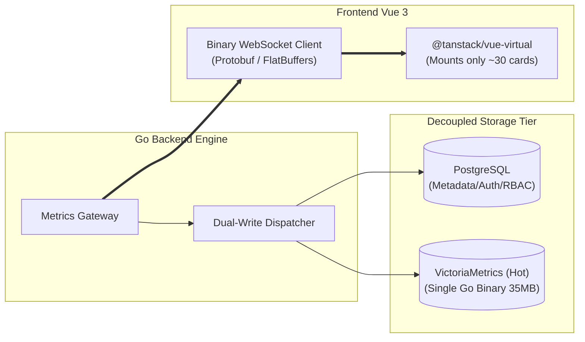
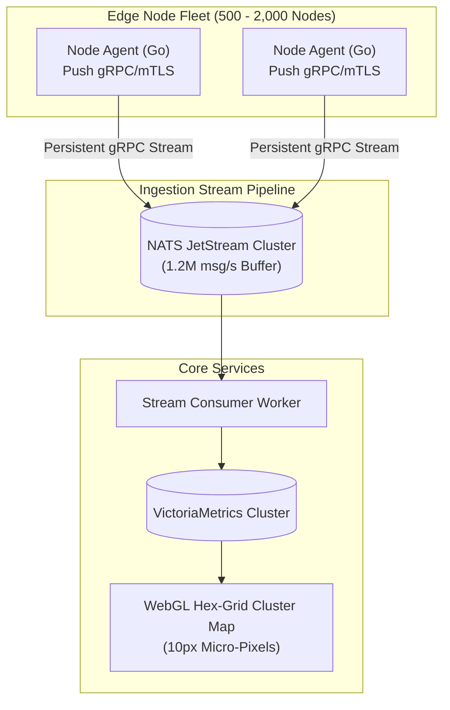
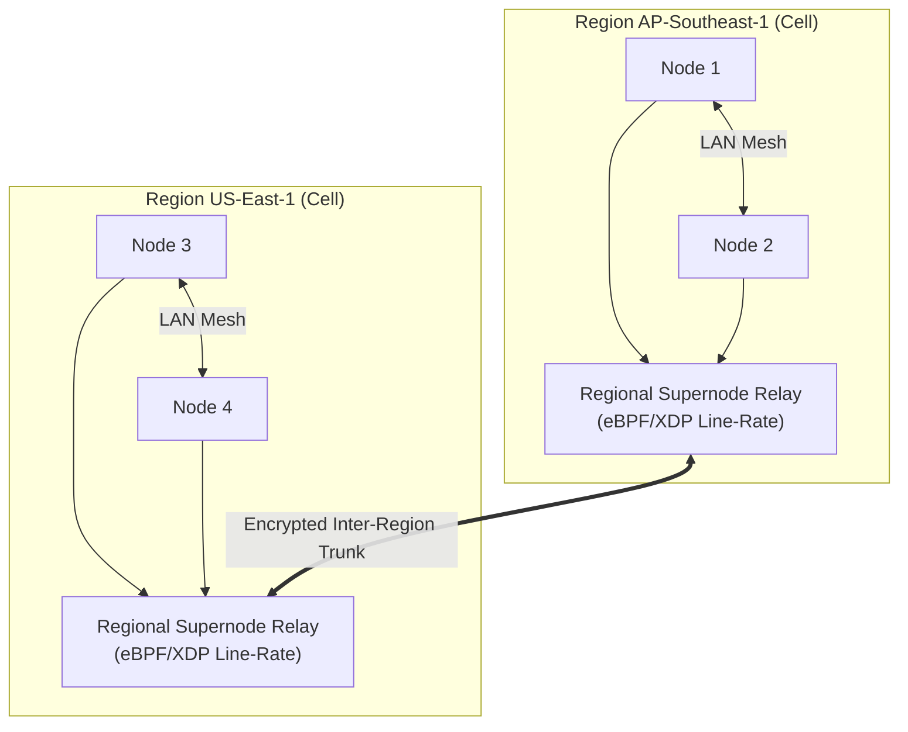
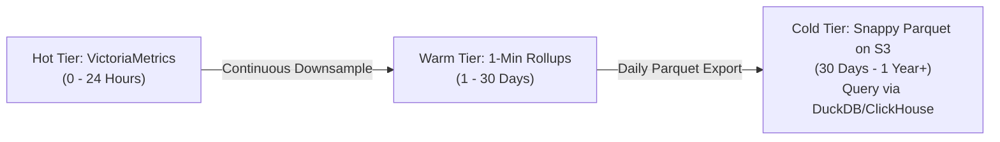

# 🏛️ Fleet Scalability Roadmap: Scaling to 10,000 Nodes

> **Document Type**: Master Architecture & Implementation Plan  
> **Target Scope**: Evolutionary Scaling from 50 to 10,000 Nodes  
> **Status**: APPROVED ARCHITECTURAL BLUEPRINT (Reference for Future Iterations)  
> **Target Branch**: `refactor/modularize-overview-components`

---

## 🎯 Executive Overview & Scaling Philosophy

Instead of over-engineering the platform on Day 1, this roadmap follows the **Evolutionary Architecture Principle (YAGNI & Progressive Sizing)**. The system scales in 4 modular, zero-downtime phases based on concrete node capacity triggers.

```
┌─────────────────────────────────────────────────────────────────────────────────────────┐
│                          EVOLUTIONARY SCALING PHASES                                    │
├─────────────────┬──────────────────┬───────────────────┬────────────────────────────────┤
│ Phase 1         │ Phase 2          │ Phase 3           │ Phase 4                        │
│ 100 - 500 Nodes │ 500 - 2,000 Nodes│ 2,000-5,000 Nodes │ 5,000 - 10,000+ Nodes          │
├─────────────────┼──────────────────┼───────────────────┼────────────────────────────────┤
│ • Virtual Scroll│ • gRPC Push Agent│ • Cellular Super- │ • Snappy Parquet on S3         │
│ • VictoriaMetric│ • NATS JetStream │   node Relays     │ • Multi-Region Federation      │
│ • Binary WS     │ • WebGL Hex-Grid │ • Edge Sentinel   │ • Global Control Plane         │
│   Delta Stream  │   Cluster Map    │   Self-Healing    │   Service Discovery            │
└─────────────────┴──────────────────┴───────────────────┴────────────────────────────────┘
```

---

## 📅 Phase 1: High-Density UI & TSDB Augmentation (100 – 500 Nodes)

* **Trigger**: Fleet grows beyond 50 nodes; browser tab memory starts exceeding 500MB; PostgreSQL disk write IO spikes during 5s polling intervals.
* **Objective**: Eliminate browser DOM lag, maintain locked 60 FPS, and offload time-series writes from PostgreSQL.



### Key Deliverables:
1. **Frontend Virtual Window Scrolling**:
   - Integrate `@tanstack/vue-virtual` into `frontend-vue/src/views/OverviewView.vue`.
   - Render only $25 - 35$ `NodeCard` elements within the active browser viewport (+ 3-card overscan buffer).
   - **Result**: DOM element count capped permanently at $< 2,000$ elements regardless of total fleet size.
2. **VictoriaMetrics Single-Binary Adapter**:
   - Add Go adapter in `internal/infrastructure/victoriametrics/tsdb_repo.go` conforming to `nodemetrics.Repository`.
   - Deploy standalone VictoriaMetrics binary (1 process, ~500MB RAM, Gorilla compression $15:1$).
   - Route high-frequency 5s metric writes to VictoriaMetrics; preserve PostgreSQL strictly for server inventory, RBAC, and incident audit trails.
3. **Binary WebSocket Delta Streaming**:
   - Replace 5MB raw JSON polling payload with binary Protobuf/FlatBuffers delta updates ($< 50\text{ KB}$ per broadcast).

---

## 📅 Phase 2: Ingestion Inversion & Cluster Map (500 – 2,000 Nodes)

* **Trigger**: Fleet crosses 500 nodes; central HTTP pull scrape causes TCP socket exhaustion (`TIME_WAIT` spikes); users need single-pane cluster visibility.
* **Objective**: Invert telemetry collection to Agent Push, add streaming message buffer, and introduce Macro Cluster Density View.



### Key Deliverables:
1. **Agent-Side Push over gRPC (Outbound mTLS)**:
   - Upgrade `k8s-agent` to establish persistent outbound gRPC/QUIC stream to the platform.
   - Eliminates need for inbound port 9100 on edge nodes; solves NAT/firewall traversal.
   - Client-side micro-batching + ZSTD compression shrinks payload to $< 1\text{ KB}$ per node/10s.
2. **NATS JetStream Ingestion Buffer**:
   - Deploy embedded or standalone NATS JetStream Raft cluster (3 nodes).
   - Serves as zero-loss backpressure buffer smoothing out traffic burst spikes.
3. **Cyber Hex-Grid / Density Matrix View**:
   - Add Canvas2D / WebGL Density Matrix component in Vue 3.
   - Renders 2,000 nodes as interactive micro-cells ($10\text{px}$) with instant hover tooltips powered by spatial Quadtree indexing ($O(\log N)$).

---

## 📅 Phase 3: Cellular Network Overlay & Edge SRE (2,000 – 5,000 Nodes)

* **Trigger**: Fleet spans multiple datacenters/clouds; full-mesh WireGuard tunnels exceed 500,000; central alert engine faces latency jitter.
* **Objective**: Partition network into cellular regions and delegate autonomous self-healing to edge agents.



### Key Deliverables:
1. **Cellular Hub-and-Spoke Mesh (eBPF FastPath)**:
   - Nodes communicate directly within local VPC/LAN.
   - Inter-region cross-WAN communication is routed through **Regional Supernode Relays** with eBPF/XDP encapsulation bypass.
   - **Result**: Cuts total WireGuard tunnels across the fleet by **$99.9\%$**.
2. **Edge Sentinel Autonomous Self-Healing Engine**:
   - `k8s-agent` runs embedded deterministic watchdog evaluating local hardware state at 100ms:
     - *Disk $> 92\%$*: Auto-prunes stopped containers, dangling build layers, and logs $> 100\text{ MB}$.
     - *Cgroup OOM Imminent*: Terminates non-critical background jobs before Linux kernel OOM killer triggers.
     - *Frozen Systemd Unit*: Issues safe restart + core dump telemetry.
   - Agent transmits only **State-Transition Delta Events** ($\text{Nominal} \rightarrow \text{Warning} \rightarrow \text{Remediated}$), eliminating 99.8% of noise.

---

## 📅 Phase 4: Hyperscale Federation & Cold Storage (5,000 – 10,000+ Nodes)

* **Trigger**: Long-term historical telemetry reaches multiple terabytes; multi-tenant compliance requires global data residency.
* **Objective**: Implement tiered parquet cold archival and multi-region federated control plane.



### Key Deliverables:
1. **Three-Tier Time-Series Lifecycle**:
   - **Hot Tier (0 – 24h)**: VictoriaMetrics / ClickHouse (full 5s raw resolution).
   - **Warm Tier (1 – 30d)**: 1-minute downsampled continuous rollups (avg, min, max, p95).
   - **Cold Tier (30d – 1y+)**: Daily partitioned Snappy Parquet files on S3/MinIO ($<\$0.015/\text{GB}/\text{month}$), queried on demand via DuckDB or ClickHouse S3 Engine.
2. **Multi-Region Control Plane Federation**:
   - Multi-cluster global discovery with Raft-backed metadata sync for global multi-tenancy.

---

## 📂 File Impact & Architecture Mapping

| Layer | Impacted Paths | Phase | Responsibilities |
|---|---|---|---|
| **Frontend UI** | `frontend-vue/src/views/OverviewView.vue`<br/>`frontend-vue/src/components/overview/virtual/`<br/>`frontend-vue/src/components/overview/matrix/` | Phase 1 & 2 | Virtual scrolling, WebGL Density Matrix, binary WebSocket receiver |
| **Agent Core** | `cmd/agent/`<br/>`internal/agent/sentinel/`<br/>`internal/agent/grpc/` | Phase 2 & 3 | gRPC push client, eBPF probes, local self-healing watchdog |
| **Ingestion** | `internal/adapter/grpc/`<br/>`internal/infrastructure/nats/` | Phase 2 | gRPC telemetry receiver, NATS JetStream publisher/consumer |
| **Storage Engine** | `internal/infrastructure/victoriametrics/`<br/>`internal/infrastructure/parquet/` | Phase 1 & 4 | VictoriaMetrics TSDB adapter, Parquet cold tier exporter |
| **Mesh Overlay** | `internal/infrastructure/wireguard/`<br/>`internal/infrastructure/ebpf/` | Phase 3 | Cellular routing, supernode relay controller |

---

## ✅ Quality Gates & Verification Milestones

1. **Gate 1 (Phase 1 Complete)**: Synthetic load test with 500 simulated nodes $\rightarrow$ Browser UI maintains 60 FPS ($< 50\text{MB}$ RAM delta); backend CPU $< 15\%$.
2. **Gate 2 (Phase 2 Complete)**: Ingest benchmark of 2,000 nodes pushing metrics every 5s ($400\text{ msg/s}$) $\rightarrow$ NATS zero message drops; end-to-end latency $< 80\text{ms}$.
3. **Gate 3 (Phase 3 Complete)**: Chaos test simulating WAN partition between 2 regions $\rightarrow$ Edge Sentinel auto-remediates local disk/OOM incidents without central coordinator.
4. **Gate 4 (Phase 4 Complete)**: 10,000 simulated nodes telemetry archival $\rightarrow$ 1-year historical analytics query over 500 million datapoints finishes in $< 1.5\text{s}$ via Parquet/DuckDB.
